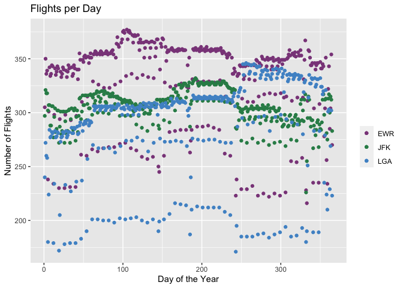

Homework3
================
Makayla Hayes
2/23/2021

Problem 1

``` r
temp<-flights%>%
  group_by(tailnum)%>%
  mutate(avg_arr_delay=mean(arr_delay,na.rm = TRUE))%>%
  select(tailnum,avg_arr_delay)
planestemp<-planes%>%
  select(tailnum,year)
final<-temp%>%
  left_join(planestemp, by = "tailnum")
head(final)
```

    ## # A tibble: 6 x 3
    ## # Groups:   tailnum [6]
    ##   tailnum avg_arr_delay  year
    ##   <chr>           <dbl> <int>
    ## 1 N14228           3.71  1999
    ## 2 N24211           7.7   1998
    ## 3 N619AA           7.65  1990
    ## 4 N804JB          -1.86  2012
    ## 5 N668DN           2.62  1991
    ## 6 N39463           2.16  2012

Problem 2

``` r
pr2<-flights%>%
  mutate(day_of_year=date(time_hour))%>%
  mutate(day_num=yday(time_hour))%>%
  group_by(day_of_year,origin)%>%
    summarise(num_sched=sum(!is.na(sched_dep_time)))%>%
  pivot_wider(names_from = origin,values_from = num_sched)

  head(pr2) 
```

    ## # A tibble: 6 x 4
    ## # Groups:   day_of_year [6]
    ##   day_of_year   EWR   JFK   LGA
    ##   <date>      <int> <int> <int>
    ## 1 2013-01-01    305   297   240
    ## 2 2013-01-02    350   321   272
    ## 3 2013-01-03    336   318   260
    ## 4 2013-01-04    339   318   258
    ## 5 2013-01-05    238   302   180
    ## 6 2013-01-06    301   307   224

``` r
ggplot(pr2,aes(x=yday(day_of_year)))+
  geom_point(aes(y=EWR,colour="EWR"))+ 
  geom_point(aes(y=JFK,colour="JFK"))+
  geom_point(aes(y=LGA,colour="LGA"))+ 
  scale_colour_manual("", 
                      breaks = c("EWR", "JFK", "LGA"),
                      values = c("orchid4", "seagreen4", "steelblue3")) +
  
  ggtitle("Flights per Day")+ylab("Number of Flights")+xlab("Day of the Year")
```

 Problem 3 Each NA means there were no flights that day that came into that airport from any of the New York airports

``` r
pr3<-flights%>%
  mutate(day_of_year=date(time_hour))%>%
  group_by(day_of_year,dest)%>%
    summarise(num_arrive=sum(!is.na(arr_time)))%>%
  pivot_wider(names_from = dest,values_from = num_arrive, values_fill = list(num_arrive=0))

head(pr3)
```

    ## # A tibble: 6 x 106
    ## # Groups:   day_of_year [6]
    ##   day_of_year   ALB   ATL   AUS   AVL   BDL   BNA   BOS   BQN   BTV   BUF   BUR
    ##   <date>      <int> <int> <int> <int> <int> <int> <int> <int> <int> <int> <int>
    ## 1 2013-01-01      3    40     6     1     2    10    25     3     7    16     2
    ## 2 2013-01-02      3    50     7     1     2    11    26     3     9    16     2
    ## 3 2013-01-03      2    49     6     0     1    11    30     3     6    13     2
    ## 4 2013-01-04      2    48     6     0     1    11    30     3     7    13     2
    ## 5 2013-01-05      2    35     4     0     2     8    20     3     8    15     2
    ## 6 2013-01-06      2    41     5     0     1    13    29     3     7    12     2
    ## # … with 94 more variables: BWI <int>, CAK <int>, CHS <int>, CLE <int>,
    ## #   CLT <int>, CMH <int>, CRW <int>, CVG <int>, DAY <int>, DCA <int>,
    ## #   DEN <int>, DFW <int>, DSM <int>, DTW <int>, EGE <int>, FLL <int>,
    ## #   GRR <int>, GSO <int>, GSP <int>, HNL <int>, HOU <int>, IAD <int>,
    ## #   IAH <int>, IND <int>, JAC <int>, JAX <int>, LAS <int>, LAX <int>,
    ## #   LGB <int>, MCI <int>, MCO <int>, MDW <int>, MEM <int>, MHT <int>,
    ## #   MIA <int>, MKE <int>, MSN <int>, MSP <int>, MSY <int>, MYR <int>,
    ## #   OAK <int>, OKC <int>, OMA <int>, ORD <int>, ORF <int>, PBI <int>,
    ## #   PDX <int>, PHL <int>, PHX <int>, PIT <int>, PSE <int>, PVD <int>,
    ## #   PWM <int>, RDU <int>, RIC <int>, ROC <int>, RSW <int>, SAN <int>,
    ## #   SAT <int>, SAV <int>, SDF <int>, SEA <int>, SFO <int>, SJC <int>,
    ## #   SJU <int>, SLC <int>, SMF <int>, SNA <int>, SRQ <int>, STL <int>,
    ## #   STT <int>, SYR <int>, TPA <int>, TUL <int>, TYS <int>, XNA <int>,
    ## #   BHM <int>, CAE <int>, BZN <int>, EYW <int>, HDN <int>, MTJ <int>,
    ## #   PSP <int>, CHO <int>, BGR <int>, ABQ <int>, ACK <int>, MVY <int>,
    ## #   TVC <int>, ANC <int>, LGA <int>, SBN <int>, ILM <int>, LEX <int>

<https://github.com/makaylahayes/Homework3_433>
